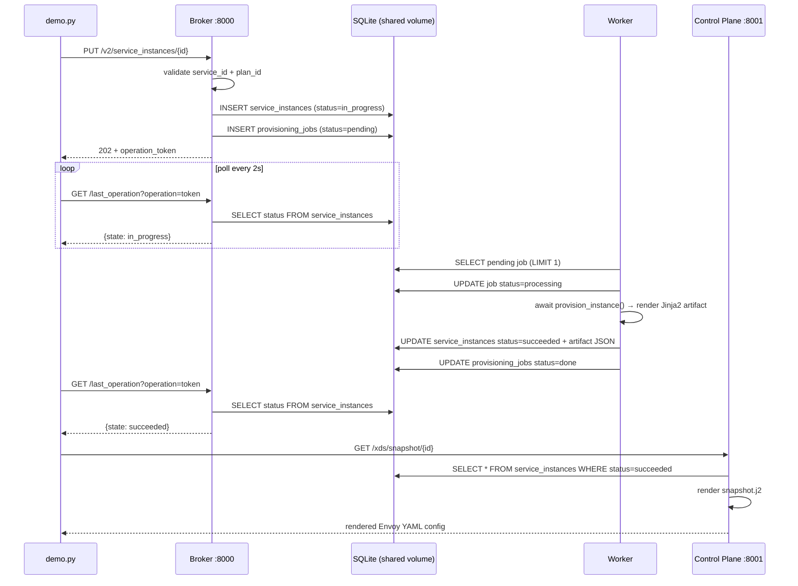

# Load Balancing Platform — Demo

A one-command learning project recreating the core architecture from an Atlassian
engineer's internal load-balancing platform talk. Three independent Python services
wired together over a shared SQLite database, runnable with a single Docker command.

## Prerequisites

**Docker (recommended — zero Python setup needed on your machine)**
```bash
docker --version        # ≥ 24.0
docker compose version  # ≥ 2.20
```

**Python-only (no Docker)**
```bash
python3 --version  # 3.11+
pip install requests  # for demo.py; see Running Tests for full deps
```

## One-Command Run

```bash
cd lb-demo
docker compose up --build -d
python demo.py
# or: make demo-flow  (builds + starts + runs demo in one step)
```

Expected final output:
```
──────────────────────────────────────────────────────────────
  DEMO COMPLETE — end-to-end flow verified
  Broker → SQLite queue → Worker → SQLite store → Control Plane
──────────────────────────────────────────────────────────────
```

**Tear down:**
```bash
docker compose down -v   # -v removes the shared DB volume
```

---

## Architecture

| Service | Port | Role |
|---------|------|------|
| `broker` | 8000 | Open Service Broker API — accepts and tracks provisioning requests |
| `worker` | — | Async poller — executes provisioning jobs, writes rendered config artifacts |
| `control_plane` | 8001 | xDS-style HTTP API — serves rendered Envoy config from the datastore |

**Shared state:** All three services read/write a single SQLite file at `/data/demo.db`
mounted on a Docker named volume. In production this is DynamoDB.

### Request Lifecycle



---

## What This Fakes vs. the Real System

| Component | In this demo | In production |
|-----------|-------------|---------------|
| **SQS** | `provisioning_jobs` SQLite table — no visibility timeout, no DLQ, single-consumer | AWS SQS with visibility timeout, dead-letter queue, N parallel worker pods |
| **DynamoDB** | `service_instances` SQLite table on a Docker volume | DynamoDB with conditional writes, GSIs for status queries, TTL |
| **xDS gRPC** | HTTP polling `GET /xds/snapshot/{id}` — no version/nonce, no ACK/NACK | gRPC ADS stream (`envoy.service.discovery.v3`) with bidirectional flow and push |
| **Real Envoy** | Rendered YAML printed to stdout; no sidecar process | Envoy sidecar reads live config via xDS and hot-reloads with zero downtime |

---

## Running Tests

Tests run against temporary SQLite databases — no Docker services need to be running.

```bash
cd lb-demo
python3 -m venv .venv && source .venv/bin/activate  # recommended
make test
# or manually:
pip install -r tests/requirements.txt
python -m pytest tests/ -v
```

## Port Conflicts

If 8000 or 8001 are taken, edit the `ports:` section in `docker-compose.yml`
(e.g. `"18000:8000"`) and update `BROKER`/`CP` constants in `demo.py` to match.

---

## First Things to Try Modifying

1. **Slow provisioning:** In `worker/provisioner.py`, change `await asyncio.sleep(1.0)` to `5.0` — watch the polling loop in `demo.py` print more `in_progress` rounds.
2. **Add a plan:** In `broker/catalog.py` add `plan-global-001` with `"algorithm": "maglev"`, then add it to `_PLAN_ALGORITHMS` in `worker/provisioner.py` and re-provision with that plan ID.
3. **Enrich Envoy config:** In `worker/templates/envoy_config.j2`, add a `health_checks:` block — it will appear in the control-plane snapshot immediately on the next GET.
4. **Scale workers:** In `docker-compose.yml`, add `deploy: {replicas: 2}` under `worker:` and run two concurrent provisions to watch both containers claim separate jobs.
